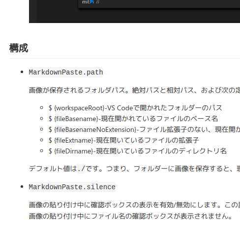

https://marketplace.visualstudio.com/items?itemName=telesoho.vscode-markdown-paste-image

https://marketplace.visualstudio.com/items?itemName=telesoho.vscode-markdown-paste-image

Ctrl+Alt+Dでweb上のファイルリンクを取得して貼り付け
Ctrl+Alt+Vでクリップボード上の画像を/imagesの中に保存してリンク貼り付け

MarkdownPaste.silence

なんやかんやsetting.jsonにしこたま追加

{
    "explorer.confirmDragAndDrop": true,
    "window.zoomLevel": 0,
    "editor.minimap.enabled": true,
    "breadcrumbs.enabled": true,
    "editor.renderWhitespace": "all",
    "pasteImage.path": "${currentFileDir}/images/",
    "pasteImage.filePathConfirmInputBoxMode": "onlyName",
    "MarkdownPaste.path": "${workspaceRoot}/images",
    "MarkdownPaste.silence": true
}
