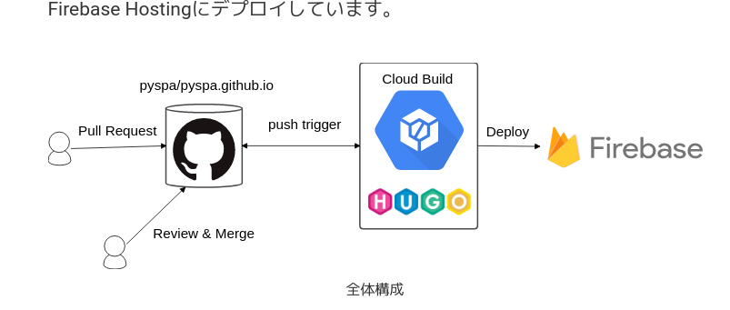

ブログを作成することは多くの場合広告より
コストが安く有用です

という分けでブログ作りたいです

軽くて自分で見やすいものがいい
Wiki仕様のが一番見やすい、マジで
md使えなかったら俺はブログなんかできない

開発を進める上でvpsにするしかない？？？のか？？
gitで更新したら、Cl動かしてコンテナ立てて自動でHPorブログ更新できるものとする

# 開発技術選定
https://qiita.com/rana_kualu/items/4727a0d64657aa837ce3
https://techracho.bpsinc.jp/hachi8833/2019_01_25/68846

front
React or Vue.js
back 
RubyonRails
cl 
Jenkins
Github

webアプリでもつくるん？？？？たかがブログやろ？？？？

##  Hugoはどうか
動的部分のないサイトは静的サイトジェネレーターで充分
ログインやテーブルに格納するものは何一ついらない

他静的サイトジェネレーター
https://note.com/airis0/n/nc0cde42a872f

##  どうやって更新したいのか
マークダウンをVScodeやInteliJ等のIDEやエディターで記入でき
そのままコマンドでアップロードできれば申し分ない

画像の挿入部分等で少し悩むが・・・

##  画像部分考慮
エディタ等でマークダウンを編集しても
画像部分の保存場所は、指定して別に画像をアップロードしないといけない

正直そんなしんどいことしてられるか？？？

マークダウンで記事をVScodeで書いた場合に、
そのプロジェクト内にファイルとして格納するのか
それともS3などの画像サーバーを必要とするのかで大きく違ってくる
いずれの場合も設定ファイル等に記入した画像の保存先に
webとエディタの両方からアクセスできる、かつコードも同一にする必要がある

## ReactかVue.jsか

https://qiita.com/yoichiwo7/items/236b6535695ea67b4fbe
https://2019.stateofjs.com/conclusion/

# 基本的なデプロイ環境

https://qiita.com/zaburo/items/8886be1a733aaf581045

ローカルで開発。
リモートにpush
pushを拾って、公開ディレクトリにpull

##  自動デプロイ環境

local　> github > jenkins > job実行にて本番反映
local　> github > AWS CodeDeploy > EC2
https://qiita.com/taka-tactical/items/7ce5ea6e6d2430f20166#1-github%E3%81%AEwebhook%E3%81%AB%E3%82%88%E3%82%8B%E9%80%A3%E6%90%BA

https://blog.pyspa.org/post/how-to-make-this-site/

https://staticsitegenerators.net/

https://www.staticgen.com/

あんまり凝ったことしたくないし・・・

https://memo.sanographix.net/post/101237278930
